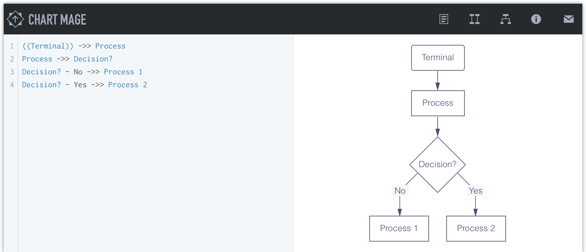

# Chart Mage
Generate sequence diagrams and flowcharts at lightning speed, in a similar manner as markdown.

### No more fiddling the layout
Keep your hands on the keyboard and let Chart Mage takes care of the drawing.

### Smart autocompletion
Chart Mage makes reasonable guess about what you are going to type.

### Simple syntax
Just look at the sentences. You can learn it in 10 seconds.

### Tech
Many thanks to the cool projects [mermaid](https://mermaidjs.github.io/), [Codemirror](https://codemirror.net/), [Underscore](https://underscorejs.org/), [node-uuid](https://github.com/broofa/node-uuid), [jQuery Modal](https://jquerymodal.com/), [base16](https://github.com/chriskempson/base16). Chart Mage was made possible by them.

### Note
I built Chart Mage three years ago when I taught myself to code. The code is messy and the comments are in Chinese. So the next thing I will do is to tidy up the code and translate the comments into English. 
